# Aero on Apple Silicon

**Windows 7 and Windows Vista with working Aero glass on an M-series Mac**

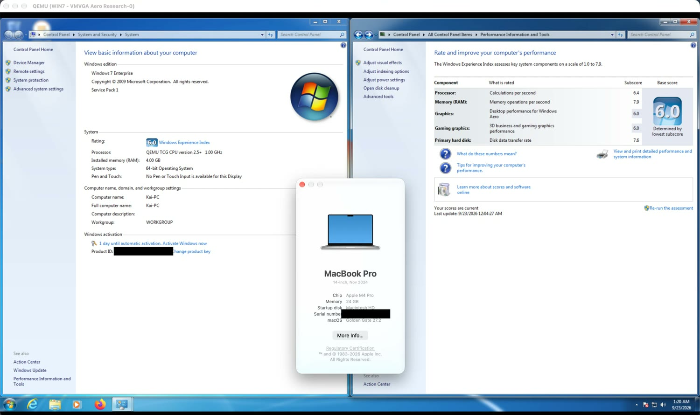


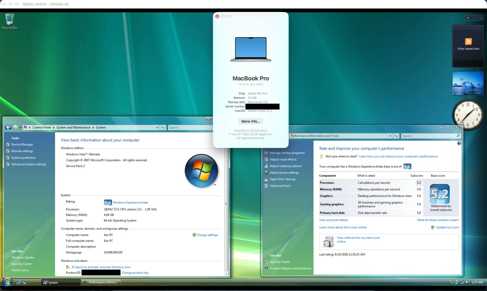

*The same on Windows Vista Ultimate SP2: Aero glass, sidebar gadgets*

This is a patched QEMU that emulates VMware's virtual 3D graphics card. Windows loads VMware's own display driver and thinks it has real hardware. QEMU translates the Direct3D commands to Vulkan with [DXVK](https://github.com/doitsujin/dxvk), and [MoltenVK](https://github.com/KhronosGroup/MoltenVK) runs them on Metal.

The x86 CPU is still emulated (QEMU TCG), because Apple Silicon cannot virtualize x86. So CPU-heavy work is slower than a real PC. The graphics, though, genuinely run on your Mac's GPU.

## What works

- **Aero glass, Flip 3D and transparency** in Windows 7 and Vista, in full colour, with no garbled window borders.
- **Windows shows your Mac's GPU name** (for example "Apple M4 Pro") in Device Manager and dxdiag. That name is a label our setup writes; the rendering really does happen on the Mac GPU.
- **The Windows Experience Index (WinSAT) assessment completes.** Windows 7: 6.0 for both Aero desktop performance and 3D gaming graphics (base 6.0). Windows Vista: 5.9 for both (base 5.2, held down by the emulated processor).
- **Resizing works like VMware Tools, without VMware Tools.** Windows switches to the exact size of the Mac window, full screen included, and the picture stays sharp on a Retina display.
- **Windows Media Center runs full screen**, and audio plays at the correct speed.
- **Copy and paste between the Mac and Windows** (clipboard sharing through SPICE).
- **Multi-core guests** (multi-threaded TCG).

## What doesn't, yet

- **Freezes, especially at high resolutions.** Every frame is copied back from the Mac's GPU, and the cost grows with the window size. A lower resolution (a smaller VM window) is noticeably smoother and hangs far less. If it does lock up, **Force stop** it from the control screen and start it again.
- **Video in Windows Media Player can stay black in a window** while it plays fine full screen. Under investigation.
- **CPU-heavy things are slow**, because x86 is emulated. 3DMark06 runs at roughly 9–27 fps, and QEMU's command processing is the current bottleneck, not the GPU.
- **3DMark06 can still fail** with `D3DERR_DEVICELOST` in some runs.
- **No DirectX 10/11.** Only D3D9-class 3D, which is what Aero and older games use.
- **The first boot and the welcome screen can be slow to draw.** The Windows 7 login wallpaper is decoded on the emulated CPU; a plain-colour desktop background avoids it.
- Only tested with Windows 7 SP1 x64 and Vista SP2 x64.

## How it got here

Screenshots from the actual work, in order. Every one of these was a real state of the project.

| | |
|---|---|
| 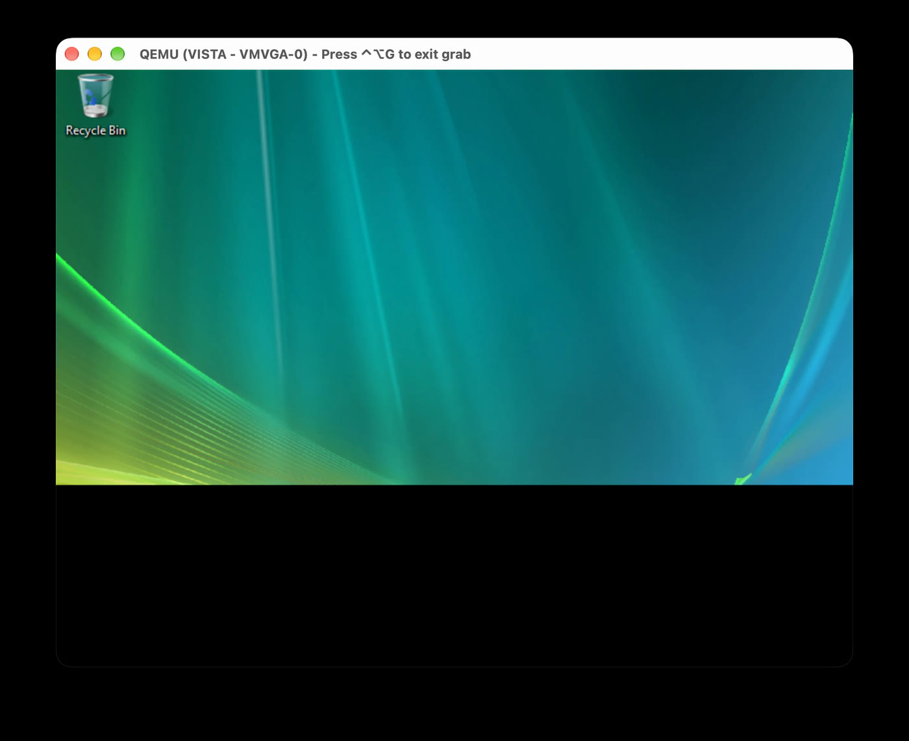 **1. Half a desktop.** Early Vista boot: the top of the screen composites, the rest is black. | 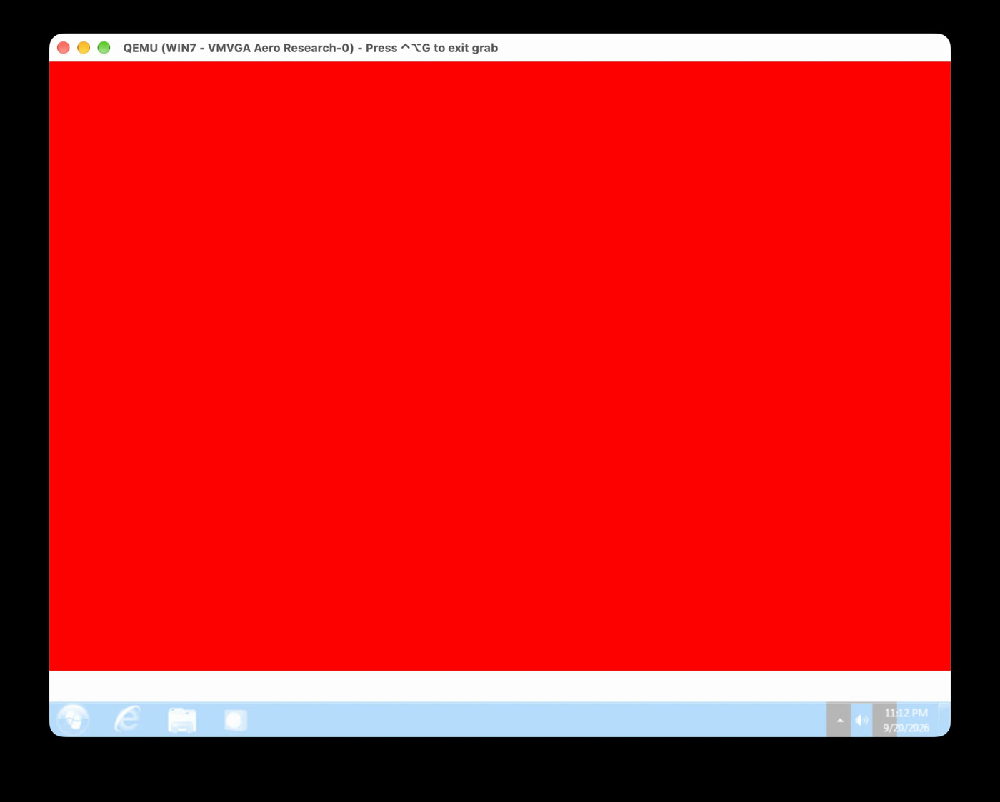 **2. Solid red.** Windows 7 with 3D "working". The desktop is there, it is just entirely one colour. |
| 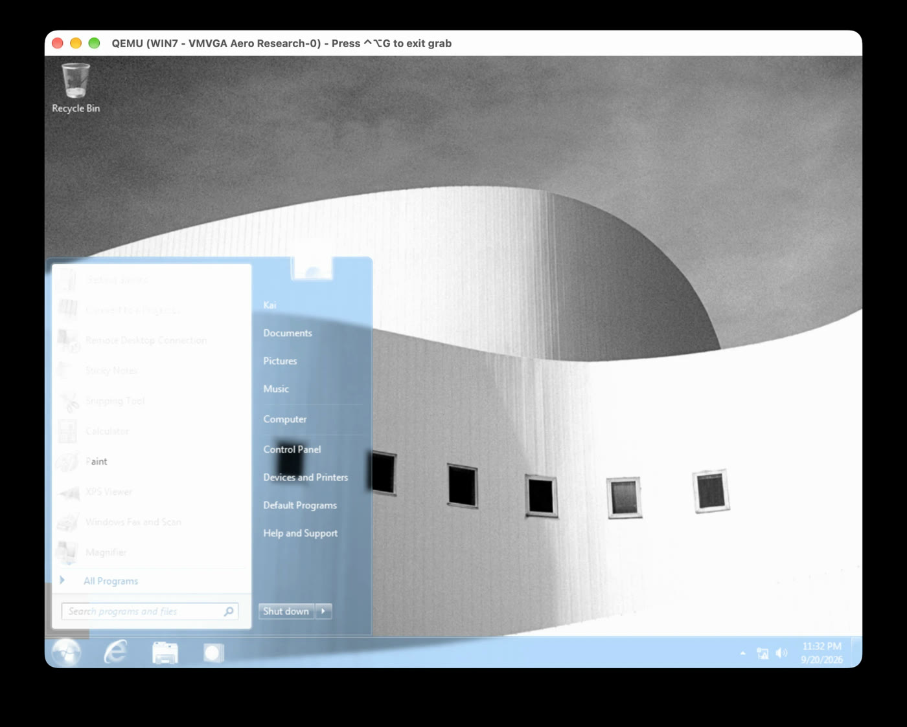 **3. Greyscale.** Aero composites correctly, in black and white. This one took days: a never-executed shadow-sampling branch in the shader made Metal treat every texture as a depth texture. | 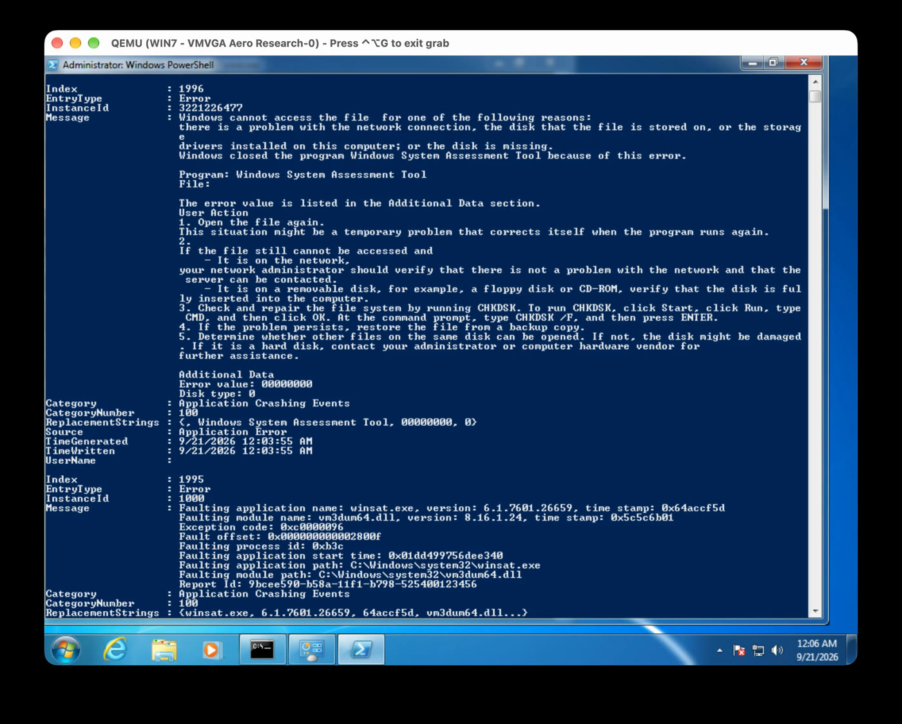 **4. Crashes.** WinSAT killed the display driver: VMware's user-mode driver calls the hypervisor backdoor from ring 3, and QEMU refused it. |
| 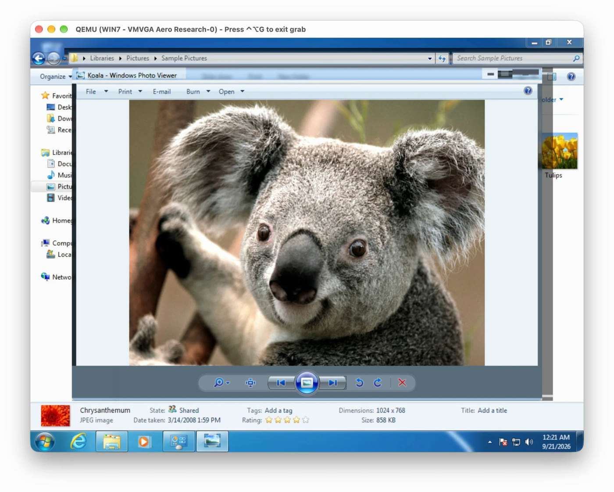 **5. Broken glass.** Colour works, but every window frame is dark and blocky whenever a 3D app is open. | 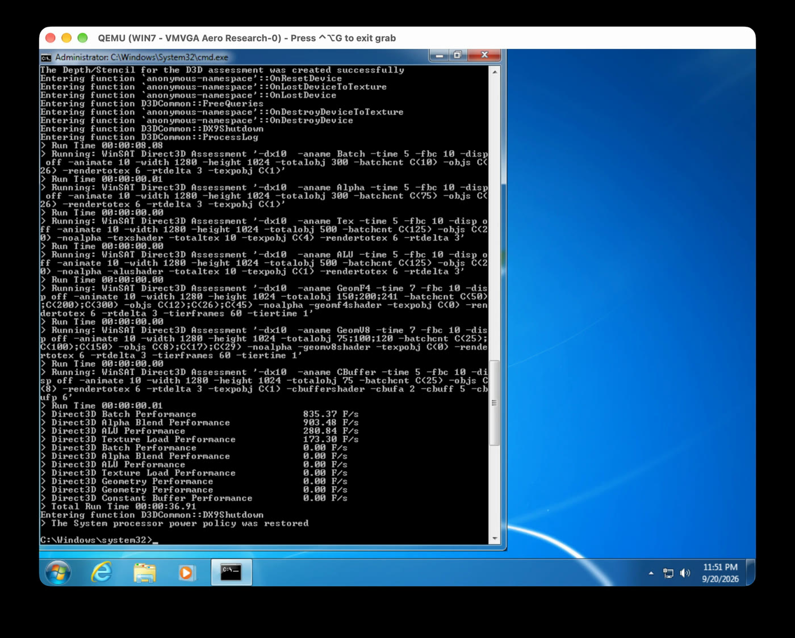 **6. Real numbers.** The Direct3D assessment runs to completion: 835 F/s batch, 903 F/s alpha blend. |
| 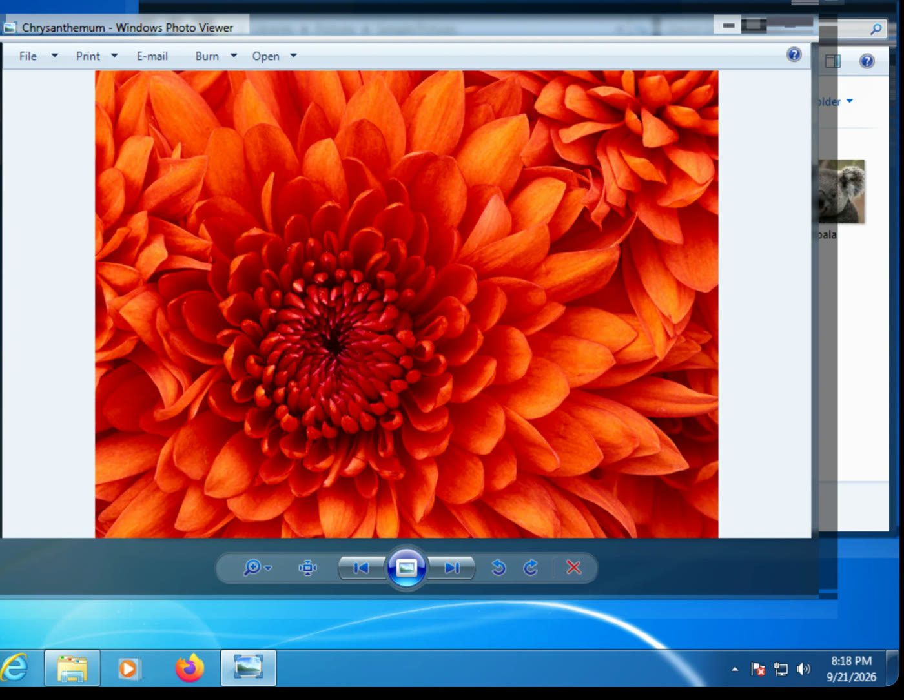 **7. Correct glass.** Full colour, proper transparency, clean frames around a D3D application. | 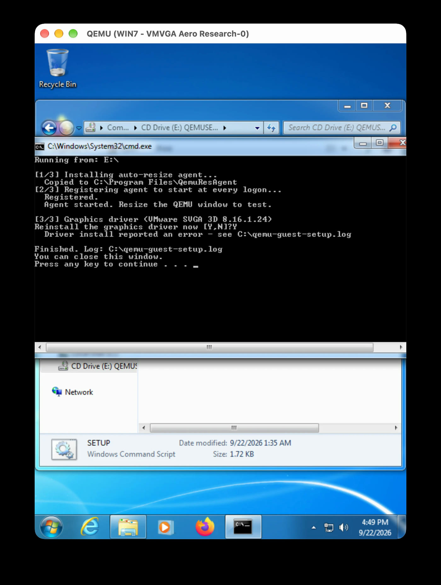 **8. One-step guest setup.** Driver, resize agent, watchdog fix and GPU name, without VMware Tools. |
| 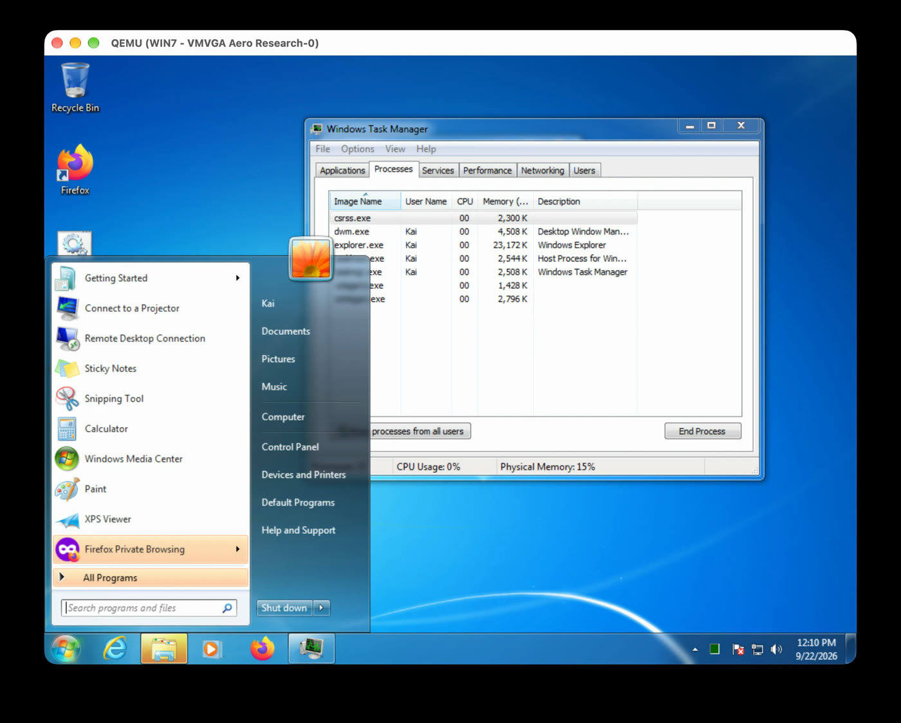 **9. Normal.** Aero glass, DWM running, and it just behaves like Windows. | 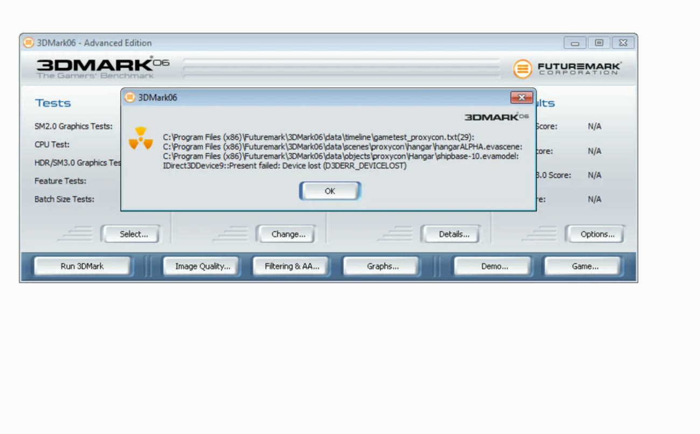 **10. Still open.** 3DMark06 runs, but slowly, and can still die with `D3DERR_DEVICELOST`. Help welcome. |

## Getting started

**You need:** an Apple Silicon Mac, [Homebrew](https://brew.sh), about 40 GB of free disk space, and your own Windows 7 or Vista installation ISO.

```bash
git clone https://github.com/The-Sequence/aero-on-apple-silicon.git
```

Then open the folder and **double-click `START HERE.command`**. That is the whole thing. It opens a control screen in the Terminal, in the style of an old DOS utility, with mouse support. Everything happens from there, and it always knows where you left off:

1. **Tools.** Downloads the runtime (about 8 MB), VMware's display driver (from VMware's own server, about 120 MB) and the clipboard components (about 10 MB), and builds the guest tools disc. Each is downloaded once.
2. **Install Windows.** Pick Windows 7 or Vista, the disk size (30 GB minimum), cores and memory, then drag your ISO into the window. The VM window opens, and the control screen shows each step of the install with what to do right now.
3. **Drivers and tools.** The VM starts with the **AEROTOOLS** disc in its CD drive. In Windows, open the disc and run `SETUP.CMD`. When the VM window resizes itself, the graphics driver is running. Let SETUP run **WinSAT** when it offers to (Windows only turns Aero on after rating the new driver), then restart Windows once and shut it down.
4. **Checks.** Windows reports back whether Aero, sound and internet work, and you drag the VM window's corner to confirm resizing.
5. **Ready.** A launcher appears on your Desktop that opens the control screen and starts the VM.

**While a VM runs,** the control screen is also its dashboard and remote control:

- **Live gauges** for the VM's CPU, the virtual graphics card, the Mac's GPU, network and memory, plus a **live log** view.
- **Ctrl+Alt+Del** (on the menu bar), Task Manager, the Windows key, Alt+Tab, inserting and ejecting discs, screenshots to your Desktop, pause, shut down, restart and force stop.
- **Settings:** cores, memory, growing the disk, sound device, network card and clipboard. Also **snapshots**, and removing VMs and downloads. Every removal asks first and never touches anything outside the project and its download cache.
- Keyboard: the highlighted letter of any menu or button activates it; F10 opens the menus.

You never need a second Terminal window. VMs run in the background, the VM window's close button is disabled so an install can't be cut off by accident, and your Mac is kept awake while a VM runs. If the control screen can't run in your Terminal, it falls back to a plain step-by-step wizard (`./START\ HERE.command --plain` forces it).

**Tips**

- **Do not install VMware Tools in the guest.** It makes the login screen crawl. `SETUP.CMD` installs only what is needed: the display driver, clipboard sharing, the resize and status helper, and two registry fixes.
- **Use a lower resolution.** The smaller the VM window (and so Windows' resolution), the smoother everything runs: every frame is copied back from the Mac's GPU, and that cost grows with the pixel count. Something like 1280×800 is far less choppy than full screen on a big display. Just resize the VM window; Windows follows it.
- **If the VM freezes** and doesn't recover within a minute, open the control screen (or the Desktop launcher) and use **Force stop**, then start it again. Windows may run a quick disk check on the next boot; that is normal.
- **Nothing is downloaded twice.** Downloads are kept in `~/Library/Caches/AeroOnAppleSilicon`, checked by SHA-256, and reused even if you delete or re-clone the folder. If `VMware-tools-windows-10.3.10-12406962.iso` is already in your Downloads or on your Desktop, setup uses it. Interrupted downloads resume.

<details>
<summary>Doing it manually instead</summary>

```bash
./Setup.command                                                  # dependencies, runtime, guest-tools.iso
MODE=install ISO=/path/to/windows.iso ./Start-Windows7.command   # install Windows
MODE=setup ./Start-Windows7.command                              # boot with the tools disc, run SETUP.CMD
./Start-Windows7.command                                         # normal boot
```

`Start-Vista.command` works the same way.
</details>

### Useful knobs

| Variable | Default | What it does |
|---|---|---|
| `VM_CPUS` | 4 | vCPUs, as one socket with N cores |
| `TCG_THREAD` | `multi` | `single` is slower but safer for memory ordering |
| `MEM` | 4096 | guest RAM in MB |
| `TB_SIZE` | 1024 | TCG translation cache in MiB |
| `AUDIO_DEVICE` | `hda` (Vista: `usb`) | `hda`, `usb` or `none` |
| `EXPERIMENTAL_OFF` | unset | set to 1 to disable every opt-in fix, for bisecting |

Every rendering fix has its own switch, listed in [`build/run-vm.sh`](build/run-vm.sh) and explained in [TECHNICAL.md](TECHNICAL.md).

## Tested on

MacBook Pro (Mac16,8), Apple M4 Pro, 12-core CPU (8 performance + 4 efficiency), 16-core GPU, 24 GB RAM, macOS 27.2.
Guests: Windows 7 SP1 x64 and Windows Vista SP2 x64.

## How this was made

This is a joint project between me, **Kai** ([@The-Sequence](https://github.com/The-Sequence) on GitHub), and **Claude**. I'm an individual student developer who is learning, and I built this with AI help.

To be completely transparent: **Claude wrote essentially all of the code, and did the debugging and the reverse engineering.** That includes the QEMU and DXVK patches, the macOS window-system shim, and the guest agent, including working out the VMware driver's private resolution interface by disassembling it.

My part was direction and testing:

- deciding what to build and what mattered next;
- running every build on real VMs, finding what broke, and describing what I saw;
- pushing back when a "fix" didn't actually fix anything.

Both halves were needed. Several root causes started from something I noticed on screen that no log line showed.

**ChatGPT (Codex) also contributed.** During one stretch it implemented the coverage-gated present path (`VMVGA_COVERAGE_GATED_PRESENT`) and two DXVK switches (`DXVK_MVK_WAIT_IDLE_ON_RESOURCE_DESTROY`, `DXVK_FORCE_FULL_RENDER_AREA`). They are in the tree as opt-in flags, and some of the handover notes this project ran on were written for it. Credit where it is due.

If you'd like to support me as a solo developer learning this way, you can sponsor me on **[GitHub Sponsors](https://github.com/sponsors/The-Sequence)**. It genuinely helps. Thank you.

- Me: Kai, [github.com/The-Sequence](https://github.com/The-Sequence)
- This project: [github.com/The-Sequence/aero-on-apple-silicon](https://github.com/The-Sequence/aero-on-apple-silicon)

## Roadmap

- **Faster 3D**: move SVGA3D command processing onto its own thread, and cut per-frame copies.
- **Find the remaining per-command cost** that limits 3DMark (see TECHNICAL.md, "Open problems").
- **DirectX 10/11** (vGPU10) for Windows 7 games.
- **Better 3D for older Windows**, in particular improving Windows XP 3D performance.
- **The main long-term goal: Quartz Extreme / Core Image (QE/CI) acceleration for x86-64 Mac OS X guests, starting with 10.9 Mavericks.**

Help is very welcome, especially on the open problems.

## Credits

**The code in this repository was written by Claude (Anthropic).** See "How this was made" above.

None of it would exist without other people's work:

- **[QEMU](https://www.qemu.org)** and its contributors — the emulator everything is built on. The VMware SVGA II device it ships was originally written by **Andrzej Zaborowski**.
- **[qemu-vmvga](https://github.com/qemus/qemu-vmvga)** by the **qemus** project, with earlier work by **[Christopher Eric Lentocha](https://github.com/CE1CECL)** — the far more complete VMware SVGA/SVGA3D device, including its DXVK-based 3D path. This project is a macOS port of that work plus bug fixes. It is the single biggest thing this depends on.
- **[DXVK](https://github.com/doitsujin/dxvk)** by **Philip Rebohle (doitsujin)** and contributors, and its **dxbc-spirv** shader compiler — Direct3D to Vulkan translation.
- **[MoltenVK](https://github.com/KhronosGroup/MoltenVK)** — Vulkan on Metal, created by **Bill Hollings / The Brenwill Workshop** and maintained by the **Khronos Group**, together with **SPIRV-Cross**.
- **Apple** — Metal, and the Apple Silicon GPUs doing the actual rendering.
- **VMware** (now Broadcom) — the SVGA/SVGA3D interface and the Windows display driver the guest uses. Their driver is downloaded from VMware's own servers at setup time and is **not** redistributed here.
- **[SPICE](https://www.spice-space.org)** and **Red Hat's virtio-win** drivers — clipboard sharing (spice-vdagent and the virtio-serial driver), downloaded from spice-space.org at setup time.
- **[SDL](https://libsdl.org)** and sdl2-compat — the host window and input.
- **[Homebrew](https://brew.sh)** — how all the dependencies get installed.
- **OpenAI's ChatGPT / Codex** — the coverage-gated present path and two DXVK flags, as described above.
- Microsoft's **Windows** and the **VMware WDDM driver** remain their owners' property. You bring your own licensed copy.
- **UL / Futuremark's 3DMark** was used for benchmarking only.

If you think your work belongs in this list and isn't here, please open an issue and I'll fix it.

## Documentation

- **[TECHNICAL.md](TECHNICAL.md)** — the full technical write-up: architecture, every fix and its root cause, the measurements, the dead ends, and the open problems. Start there if you want to help.
- [`patches/`](patches) — the source patches, against QEMU 9.2.2 and pinned DXVK commits.
- [`build/build-from-source.sh`](build/build-from-source.sh) — build everything yourself.

## License

GPL-2.0-or-later, following QEMU and qemu-vmvga. See [LICENSE](LICENSE) and [THIRD-PARTY.md](THIRD-PARTY.md).

No Microsoft or VMware files are included in this repository. You supply your own Windows ISO, and the VMware display driver is downloaded from VMware's own servers at setup time.
